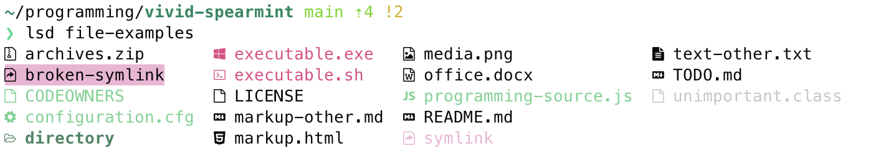

# vivid-spearmint

## About
A minty theme for ls using [vivid](https://github.com/sharkdp/vivid) and pl10k.

I believe this relies on using the default light color palette in iTerm2 for the hex codes and 
numeric colors to line up properly.

This may undergo updates as I use it in real life and see how I like it.

`/file-examples` includes examples of various files for testing:


## Palette
Colors adapted from [this lovely color palette](https://colorpalettes.net/color-palette-1348/) and variants of ["magic mint"](https://www.colorhexa.com/aaf0d1).

- light_gray: #c6c6c6, 251
- dark_gray: #3a3a3a, 237
- black: #080808, 232
- light_mint: #c2fbd9, 158
- mint: #67d38e, 042
- deep_green: #3e8562, 029
- light_pink: #f2b3d5, 218
- pink: #e84686, 198


## Installation (LS_COLORS)
1. Clone this repo
2. Copy `spearmint.yml` into the `~/.config/vivid/themes` directory. 
```
cp spearmint.yml ~/.config/vivid/themes/spearmint.yml
```
3. Add `export LS_COLORS="$(vivid generate spearmint)"` to your `~/.zshrc`.

## Installation (Powerlevel10k)
Update the following lines in `~/.p10k.zsh` to have the given colors (note these are not contiguous in the config file):
```
typeset -g POWERLEVEL9K_PROMPT_CHAR_OK_{VIINS,VICMD,VIVIS,VIOWR}_FOREGROUND=42 # mint; was 76
typeset -g POWERLEVEL9K_PROMPT_CHAR_ERROR_{VIINS,VICMD,VIVIS,VIOWR}_FOREGROUND=198 # pink; was 196
typeset -g POWERLEVEL9K_DIR_FOREGROUND=232 # black; was 31
typeset -g POWERLEVEL9K_DIR_SHORTENED_FOREGROUND=251 # light_gray; was 103
typeset -g POWERLEVEL9K_DIR_ANCHOR_FOREGROUND=29 # deep_green; was 39
typeset -g POWERLEVEL9K_STATUS_OK_FOREGROUND=42 # mint; was 70
typeset -g POWERLEVEL9K_STATUS_OK_PIPE_FOREGROUND=42 # mint; was 70
typeset -g POWERLEVEL9K_STATUS_ERROR_FOREGROUND=198 # pink; was 160
typeset -g POWERLEVEL9K_STATUS_ERROR_SIGNAL_FOREGROUND=198 # pink; was 160
typeset -g POWERLEVEL9K_STATUS_ERROR_PIPE_FOREGROUND=198 # pink; was 160
local      clean='%42F'   # green foreground, was 76
local conflicted='%198F'  # red foreground, was 196
```